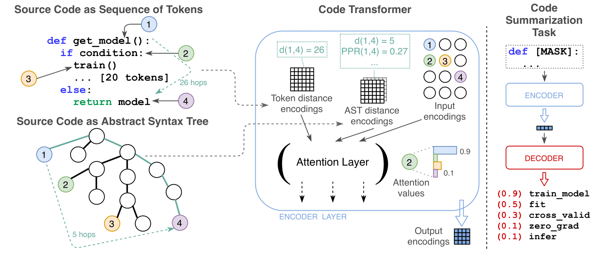
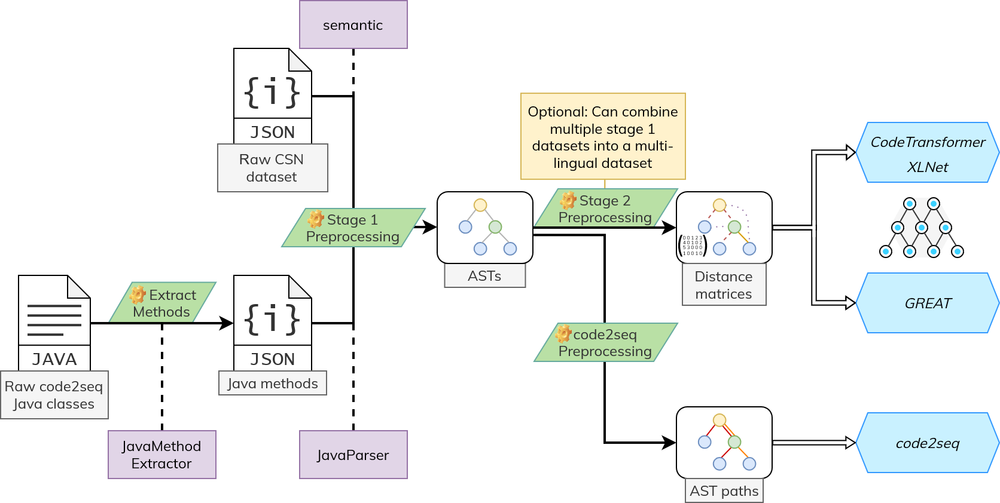

# Code Transformer

This is an official PyTorch implementation of the `CodeTransformer` model proposed in:  
> D. Zügner, T. Kirschstein, M. Catasta, J. Leskovec, and S. Günnemann, *“Language-agnostic representation learning of source code from structure and context”*

which appeared at **ICLR'2021**.  
An online demo is available at [https://code-transformer.org](https://code-transformer.org).

[[Paper (PDF)](https://arxiv.org/pdf/2103.11318.pdf) | [Poster](https://www.in.tum.de/fileadmin/w00bws/daml/code-transformer/iclr_2021_poster.pdf) | [Slides](https://www.in.tum.de/fileadmin/w00bws/daml/code-transformer/iclr_2021_slides.pdf) | [Online Demo](http://code-transformer.org)]

The `CodeTransformer` is a Transformer based architecture that jointly learns from source code (Context) and parsed abstract syntax trees (AST; Structure). 
It does so by linking source code tokens to AST nodes and using pairwise distances (e.g., Shortest Paths, PPR) between the nodes to represent the AST. 
This combined representation is processed in the model by adding the contributions of each distance type to the raw self-attention score between two input tokens (See the paper for more details).  



Strengths of the `CodeTransformer`:
 - Outperforms other approaches on the source **code summarization** task.
 - Effectively leverages similarities among different programming languages when trained in a **multi-lingual setting**.
 - Produces **useful embeddings** that may be employed for other down-stream tasks such as finding similar code snippets across languages. 

### Cite
Please cite our paper if you use the model, experimental results, or our code in your own work:
```bibtex
@inproceedings{zuegner_code_transformer_2021,
title = {Language-Agnostic Representation Learning of Source Code from Structure and Context},
author = {Z{\"u}gner, Daniel and Kirschstein, Tobias and Catasta, Michele and Leskovec, Jure and G{\"u}nnemann, Stephan},
booktitle={International Conference on Learning Representations (ICLR)},
year = {2021} }
```

# Table of Contents


- [1\. Repository Setup](#1-repository-setup)
    - [1.1. Data](#11-data)
        - [1.1.1. Raw Data](#111-raw-data)
        - [1.1.2. Preprocessed Data](#112-preprocessed-data)
    - [1.2. Example Notebooks](#12-example-notebooks)
    - [1.3. Environment Variables](#13-environment-variables)
    - [1.4. Repository Structure](#14-repository-structure)
- [2\. Preprocessing](#2-preprocessing)
    - [2.1. semantic](#21-semantic)
    - [2.2. JavaParser & JavaMethodExtractor](#22-javaparser--javamethodextractor)
    - [2.3. CSN Dataset](#23-csn-dataset)
    - [2.4. code2seq Dataset](#24-code2seq-dataset)
    - [2.5. Multi-language](#25-multilanguage-dataset)
- [3\. Training](#3-training)
    - [3.1. Code Transformer](#31-code-transformer)
    - [3.2. GREAT](#32-great)
    - [3.3. XLNet (No structure)](#33-xlnet-no-structure)
    - [3.4. Language Modeling Pretraining](#34-language-modeling-pretraining)
- [4\. Evaluation](#4-evaluation)
    - [4.1. Single Language Evaluation](#41-single-language)
    - [4.2. Multi-language Evaluation](#42-multilanguage)
- [5\. Models from the paper](#5-models-from-the-paper)
    - [5.1. Models trained on CSN dataset](#51-models-trained-on-csn-dataset)
    - [5.2. Models trained on code2seq dataset](#52-models-trained-on-code2seq-dataset)
    - [5.3. Models from ablation studies](#53-models-from-ablation-studies)
    - [5.4. Download Models](#54-download-models)

    
# 1. Repository Setup

## 1.1. Data

To run experiments with the CodeTransformer you can either:
  1. Create a new dataset from **raw** code snippets  
     or
  2. Download the already **preprocessed** datasets we conducted our experiments on


### 1.1.1. Raw Data
To use our pipeline to generate a new dataset for code summarization, a collection of methods in the target language is needed. 
In our experiments, we use the following unprocessed datasets:

Name | Description | Obtain from
--- | --- | ---
code2seq | We use `java-small` for Code Summarization as well as `java-medium` and `java-large` for Pretraining | [code2seq repository](https://github.com/tech-srl/code2seq)
CodeSearchNet (CSN) | For our (multilingual) experiments on Python, JavaScript, Ruby and Go, we employ the raw data from the CSN challenge | [CodeSearchNet repository](https://github.com/github/CodeSearchNet)
`java-pretrain` | For our Pretraining experiments, we compiled and deduplicated a large code method dataset based on `java-small`, `java-medium` and `java-large`.  | <ul><li> [java-pretrain-raw.tar.gz](https://syncandshare.lrz.de/dl/fiAynTGriqnd3jneXWCaUtaC/java-pretrain-raw.tar.gz): .txt files with paths to the .java files from the code2seq datasets for each partition</li><li> [java-pretrain-raw-methods.tar.gz](https://syncandshare.lrz.de/dl/fi7orY63QYiUeMPGCCb4fsHb/java-pretrain-raw-methods.tar.gz): Extracted Java methods stored in .json files. Can be directly fed into stage 1 Preprocessing </li></ul>

### 1.1.2. Preprocessed Data

We make our preprocessed datasets available for a quick setup and easy reproducibility of our results:

Name | Language(s) | Based on | Download
--- | --- | --- | ---
Python | Python | CSN | [python.tar.gz](https://syncandshare.lrz.de/dl/fi5NDSSUYPnEQ2D6zga4XtN5/python.tar.gz)
JavaScript | JavaScript | CSN | [javascript.tar.gz](https://syncandshare.lrz.de/dl/fiMwJmQ1LBsKuqwaLJU9TbGf/javascript.tar.gz)
Ruby | Ruby | CSN | [ruby.tar.gz](https://syncandshare.lrz.de/dl/fi7pgkBDp13sYPcX8KGwFhqP/ruby.tar.gz)
Go | Go | CSN | [go.tar.gz](https://syncandshare.lrz.de/dl/fiUieK6BQ1LAWdLfSn9myDUD/go.tar.gz)
Multi-language | Python, JavaScript, Ruby, Go | CSN | [multi-language.tar.gz](https://syncandshare.lrz.de/dl/fiLNKYzUmYnSCtTdhVPwEyfz/multi-language.tar.gz)
java-small | Java | code2seq | <ul><li>[java-small.tar.gz](https://syncandshare.lrz.de/dl/fi9phA15Ga1jHGxbp6tbWZG9/java-small.tar.gz)</li><li>[java-small-pretrain.tar.gz](https://syncandshare.lrz.de/dl/fiMMKup8E41d7ybQyNnbSLXB/java-small-pretrain.tar.gz): For fine-tuning the pretrained model on `java-small`</li></ul>
java-pretrain | Java | code2seq | Full dataset available on request due its enormous size <br /> <ul><li>[java-pretrain-vocabularies.tar.gz](https://syncandshare.lrz.de/dl/fiTj35Vo4ZGHeDjHN2Uh8XYH/java-pretrain-vocabularies.tar.gz): Contains only the vocabularies from pretraining and can be used for fine-tuning the pretrained `CT-LM-1` model on any other Java dataset </li></ul>

## 1.2. Example notebooks

The `notebooks/` folder contains two example notebooks that showcase the `CodeTransformer`:
 1. [interactive_prediction.ipynb](notebooks/interactive_prediction.ipynb): Lets you load any of the [models](#5-models-from-the-paper) and specify an arbitrary code snippet to get a real-time prediction for its method name. Also showcases stage 1 and stage 2 preprocessing.
 2. [deduplicate_java_pretrain.ipynb](notebooks/deduplicate_java_pretrain.ipynb): Explains how we deduplicated the large `java-pretrain` dataset that we created


## 1.3. Environment Variables

All environment variables (and thus external dependencies on the host machine) used in the project have to be specified in an `.env` configuration file. 
These have to be set to suit your local setup before anything can be run.  
The [.env.example](.env.example) file gives an example configuration. The actual configuration has to be put into `${HOME}/.config/code_transformer/.env`.  
Alternatively, you can also directly specify the paths as environment variables, e.g., by sourcing the .env file.

Variable (+ `CODE_TRANSFORMER_` prefix) | Description | Preprocessing | Training | Inference/Evaluation
---|---|---|---|---
**Mandatory** |||
`DATA_PATH` | Location for storing datasets | X | X | X
`BINARY_PATH` | Location for storing executables | X | - | -
`MODELS_PATH` | Location for storing model configs, snapshots and predictions | - | X | X
`LOGS_PATH` | Location for logging train metrics | - | X | -
**Optional** |||
`CSN_RAW_DATA_PATH` | Location of the downloaded raw CSN dataset files | X | - | -
`CODE2SEQ_RAW_DATA_PATH` | Location of the downloaded raw code2seq dataset files (Java classes) | X | - | -
`CODE2SEQ_EXTRACTED_METHODS_DATA_PATH` | Location of the code snippets extracted from the raw code2seq dataset with the JavaMethodExtractor | X | - | -
`DATA_PATH_STAGE_1` | Location of stage 1 preprocessing result (parsed ASTs) | X | - | -
`DATA_PATH_STAGE_2` | Location of stage 2 preprocessing result (computed distances) | X | X | X
`JAVA_EXECUTABLE` | Command for executing java on the machine | X | - | -
`JAVA_METHOD_EXTRACTOR_EXECUTABLE` | Path to the built .jar from the `java-method-extractor` submodule used for extracting methods from raw .java files | X | - | -
`JAVA_PARSER_EXECUTABLE` | Path to the built .jar from the `java-parser` submodule used for parsing Java ASTs | X | - | -
`SEMANTIC_EXECUTABLE` | Path to the built semantic executable used for parsing Python, JavaScript, Ruby and Go ASTs | X | - | -


## 1.4. Repository Structure

```yaml
├── notebooks               # Example notebooks that showcase the CodeTransformer
├── code_transformer        # Main python package containing most functionality
│   ├── configuration         # Dict-style Configurations of ML models
│   ├── experiments           # Experiment setups for running preprocessing or training
│   │   ├── mixins              # Lightweight experiment modules that can be easily 
│   │   │                       #   combined for different datasets and models
│   │   ├── code_transformer    # Experiment configs for training the CodeTransformer
│   │   ├── great               # Experiment configs for training GREAT
│   │   ├── xl_net              # Experiment configs for training XLNet
│   │   ├── preprocessing       # Implementation scripts for stage 1 and stage 2 preprocessing
│   │   │   ├── preprocess-1.py   # Parallelized stage 1 preprocessing (Generating of ASTs from methods + word counts)
│   │   │   └── preprocess-2.py   # Parallelized stage 2 preprocessing (Calculating of distances in AST + vocabulary)
│   │   ├── paper               # Train configs for reproducing results of all models mentioned in the paper
│   │   └── experiment.py       # Main experiment setup containing training loop, evaluation, 
│   │                           #   metrics, logging and loading of pretrained models
│   ├── modeling              # PyTorch implementations of the Code Transformer, 
│   │   │                     #   GREAT and XLNet with different heads
│   │   ├── code_transformer    # CodeTransformer implementation
│   │   ├── decoder             # Transformer Decoder implementation with Pointer Network
│   │   ├── great_transformer   # Adapted implementation of GREAT for code summarization
│   │   ├── xl_net              # Adapted implementation of XLNet for code summarization
│   │   ├── modelmanager        # Easy loading of stored model parameters
│   │   └── constants.py        # Several constants affecting preprocessing and vocabularies
│   ├── preprocessing         # Implementation of preprocessing pipeline + data loading
│   │   │                     #   modeling, e.g., special tokens or number of method name tokens
│   │   ├── pipeline            # Stage 1 and Stage 2 preprocessing of CodeSearchNet code snippets
│   │   │   ├── code2seq.py       # Adaptation of code2seq AST path walks for CSN datasets and languages
│   │   │   ├── filter.py         # Low-level textual code snippet processing used during stage 1 preprocessing
│   │   │   ├── stage1.py         # Applies filters to code snippets and calls semantic to generate ASTs
│   │   │   └── stage2.py         # Contains only definitions of training samples, actual
│   │   │                         #   graph distance calculation is contained in preprocessing/graph/distances.py
│   │   ├── datamanager         # Easy loading and storing of preprocessed code snippets
│   │   │   ├── c2s               # Loading of raw code2seq dataset files
│   │   │   ├── csn               # Loading and storing of CSN dataset files
│   │   │   └── preprocessed.py   # Dataset-agnostic loading of stage 1 and stage 2 preprocessed samples
│   │   ├── dataset             # Final task-specific preprocessing before data is fed into model, i.e.,
│   │   │   │                   #   python modules to be used with torch.utils.data.DataLoader
│   │   │   ├── base.py           # task-agnostic preprocessing such as mapping sequence tokens to graph nodes
│   │   │   ├── ablation.py       # only-AST ablation
│   │   │   ├── code_summarization.py # Main preprocessing for the Code Summarization task.
│   │   │   │                         #   Masking the function name in input, drop punctuation tokens
│   │   │   └── lm.py             # Language Modeling pretraining task. Generate permutations
│   │   ├── graph               # Algorithms on ASTs
│   │   │   ├── alg.py            # Graph distance metrics such as next siblings
│   │   │   ├── ast.py            # Generalized AST as graph that handles semantic and Java-parser ASTs.
│   │   │   │                     #   Allows assigning tokens that have no corresponding AST node
│   │   │   ├── binning.py        # Graph distance binning (equal and exponential)
│   │   │   ├── distances.py      # Higher level modularized distance and binning wrappers for use in preprocessing
│   │   │   └── transform.py      # Core of stage2 preprocessing that calculates general graph distances  
│   │   └── nlp                 # Algorithms on text
│   │       ├── javaparser.py     # Python wrapper of java-parser to generate ASTs from Java methods
│   │       ├── semantic.py       # Python wrapper of semantic parser to generate ASTs
│   │       │                     #   from languages supported by semantic
│   │       ├── text.py           # Simple text handling such as positions of words in documents
│   │       ├── tokenization.py   # Mostly wrapper around Pygments Tokenizer to tokenize (and sub-tokenize) code snippets
│   │       └── vocab.py          # Mapping of the most frequent tokens to IDs understandable for ML models
│   ├── utils
│   │   └── metrics.py        # Evaluation metrics. Mostly, different F1-scores
│   └── env.py               # Defines several environment variables such as paths to executables 
├── scripts               # (Python) scripts intended to be run from the command line "python -m scripts/{SCRIPT_NAME}"
│   ├── code2seq
│   │   ├── combine-vocabs-code2seq.sh    # Creates code2seq vocabularies for multi-language setting 
│   │   ├── preprocess-code2seq.py        # Preprocessing for code2seq (Generating of tree paths).
│   │   │                                 #   Works with any datasets created by preprocess-1.py
│   │   ├── preprocess-code2seq.sh        # Calls preprocess-code2seq.py and preprocess-code2seq-helper.py.
│   │   │                                 #   Generates everything else code2seq needs, such as vocabularies
│   │   └── preprocess-code2seq-helper.py # Copied from code2seq. Performs vocabulary generation and normalization of snippets
│   ├── evaluate.py                   # Loads a trained model and evaluates it on a specified dataset
│   ├── evaluate-multilanguage.py     # Loads a trained multi-language model and evaluates it on a multi-language database  
│   ├── deduplicate-java-pretrain.py  # De-duplicates a directory of .java files (used for java-pretrain)
│   ├── extract-java-methods.py       # Extracts Java methods from raw .java files to feed into stage 1 preprocessing
│   ├── run-experiment.py             # Parses a .yaml config file and starts training of a CodeTransformer/GREAT/XLNet model
│   └── run-preprocessing.py          # Parses a .yaml config file and starts stage 1 or stage 2 preprocessing
├── sub_modules             # Separate modules
│   ├── code2seq               # code2seq adaptation: Mainly modifies code2seq for multi-language setting
│   ├── java-method-extractor  # code2seq adaptation: Extracts Java methods from .java files as JSON 
│   └── java-parser            # Simple parser wrapper for generating Java ASTs
├── tests                   # Unit Tests for parts of the project
└── .env.example            # Example environment variables configuration file
```


# 2. Preprocessing



## 2.1. semantic

The first stage of our preprocessing pipeline makes use of [semantic](https://github.com/github/semantic) to generate ASTs from code snippet that are written in Python, JavaScript, Ruby or Go.  
`semantic` is a command line tool written in Haskell that is capable of parsing source code in a variety of languages.
The generated ASTs mostly share a common set of node types which is important for multi-lingual experiments.
For Java, we employ a separate AST parser, as the language currently is not supported by `semantic`.  
To obtain the ASTs, we rely on the `--json-graph` option that has been dropped temporarily from `semantic`.
As such, the stage 1 preprocessing requires a `semantic` executable built from a revision before Mar 27, 2020.
E.g., the revision [34ea0d1dd6](https://github.com/github/semantic/tree/34ea0d1dd6ac1a142e2215f097f17abeed66de34).  

To enable stage 1 preprocessing, you can either:

1. Build `semantic` on your machine using a revision with the `--json-graph` option. We refer to the `semantic` documentation for build instructions.  
or
2. Use the statically linked `semantic` executable that we built for our experiments: [semantic.tar.gz](https://syncandshare.lrz.de/dl/fiK3DkYhvPaS1sENaGuABvi8/semantic.tar.gz)

## 2.2. JavaParser & JavaMethodExtractor

As Java is not currently supported by semantic, we employ a separate AST parser based on the [javaparser](https://github.com/javaparser/javaparser) project.
Our adaption can be found in the [/sub_modules/java-parser](sub_modules/java-parser) directory that also contains a prebuilt [java-parser-1.0-SNAPSHOT.jar](sub_modules/java-parser/target/java-parser-1.0-SNAPSHOT.jar).

If you want to reproduce our experiments on the code2seq Java dataset or assemble your own Java dataset to train the `CodeTransformer` you can also make use of the [JavaMethodExtractor-1.0.0-SNAPSHOT.jar](sub_modules/java-method-extractor/target/JavaMethodExtractor-1.0.0-SNAPSHOT.jar) that gathers Java methods from a folder structure of class files.

## 2.3. CSN Dataset

Download the raw CSN dataset files as described in the [raw data section](#111-raw-data).

1. Compute ASTs (stage 1)
   ```shell
    python -m scripts.run-preprocessing code_transformer/experiments/preprocessing/preprocess-1-csn.yaml {python|javascript|ruby|go} {train|valid|test} 
   ```
2. Compute graph distances (stage 2)  
    ```shell
    python -m scripts.run-preprocessing code_transformer/experiments/preprocessing/preprocess-2.yaml {python|javascript|ruby|go} {train|valid|test}
   ```

The `.yaml` files contain configurations for preprocessing (e.g., which distance metrics to use and how the vocabularies are generated).  
It is important to run the preprocessing for the `train` partition first as statistics for generating the vocabulary that are needed for the other partitions are computed there.

## 2.4. code2seq Dataset

Download the raw code2seq dataset files (Java classes) as described in the [raw data section](#111-raw-data).
1. Extract methods from the raw Java class files via  
    ```shell
    python -m scripts.extract-java-methods {java-small|java-medium|java-large}
   ```
2. Compute ASTs (stage 1)  
    ```shell
    python -m scripts.run-preprocessing code_transformer/experiments/preprocessing/preprocess-1-code2seq.yaml {java-small|java-medium|java-large} {train|valid|test}
   ```
3. Compute graph distances (stage 2)  
    ```shell
    python -m scripts.run-preprocessing code_transformer/experiments/preprocessing/preprocess-2.yaml {java-small|java-medium|java-large} {train|valid|test}
   ```

The `.yaml` files contain configurations for preprocessing (e.g., which distance metrics to use and how the vocabularies are generated).  
Ensure to run the preprocessing for the `train` partition first as statistics for generating the vocabulary that are needed for the other partitions are computed there.


## 2.5. Multilanguage Dataset

Builds upon the stage 1 CSN datasets computed as shown above. Datasets are then combined by simply running the stage 2 preprocessing with a comma-separated string containing the desired languages. For the experiments in our paper we combined Python, JavaScript, Ruby and Go:  
```shell
python -m scripts.run-preprocessing code_transformer/experiments/preprocessing/preprocess-2.yaml python,javascript,ruby,go {train|valid|test}
```


# 3. Training

Similar to how preprocessing works, training is configured via .yaml files that describe the data representation that is used, the model hyperparameters and how training should go about.  
Train metrics are logged to a tensorboard in `LOGS_PATH`.

## 3.1. Code Transformer

```shell
python -m scripts.run-experiment code_transformer/experiments/code_transformer/code_summarization.yaml
```
This will start training of a `CodeTransformer` model. The `.yaml` file contains model and training configurations (e.g., which dataset to use, model hyperparameters or when to store checkpoints).

## 3.2. GREAT

We adapted the [Graph Relational Embedding Attention Transformer](https://github.com/VHellendoorn/ICLR20-Great) (GREAT) for comparison.

```shell
python -m scripts.run-experiment code_transformer/experiments/great/code_summarization.yaml
```
This will start training of a `GREAT` model. The `.yaml` file contains model and training configurations (e.g., which dataset to use, model hyperparameters or when to store checkpoints).


## 3.3. XLNet (No structure)

For comparison, we also employed an XLNet architecture that only learns from the source code token sequence. 

```shell
python -m scripts.run-experiment code_transformer/experiments/xl_net/code_summarization.yaml
```
This will start training of a `XLNet` model. The `.yaml` file contains model and training configurations (e.g., which dataset to use, model hyperparameters or when to store checkpoints).


## 3.4. Language Modeling Pretraining

The performance of Transformer architectures can often be further improved by first pretraining the model on a language modeling task.  
In our case, we make use of XL-Nets permutation based masked language modeling.  
Language Modelling Pretraining can be run via:
```shell
python -m scripts.run-experiment code_transformer/experiments/code_transformer/language_modeling.yaml
```  
The pretrained model can then be finetuned on the Code Summarization task using the regular training script as described above.
The `transfer_learning` section in the .yaml configuration file is used to define the model and snapshot to be finetuned. 

# 4. Evaluation

## 4.1. Single Language

```shell
python -m scripts.evaluate {code_transformer|great|xl_net} {run_id} {snapshot} {valid|test}
```  
where `run_id` is the unique name of the run as printed during training. This also corresponds to the folder name that contains the respective stored snapshots of the model.  
`snapshot` it the training iteration in which the snapshot was stored, e.g., `50000`.

## 4.2. Multilanguage

```shell
python -m scripts.evaluate-multilanguage {code_transformer|great|xl_net} {run_id} {snapshot} {valid|test} [--filter-language {language}]
```  
The `--filter-language` option can be used to run the evaluation only on one of the single languages that the respective multilanguage dataset is comprised of (used for `CT-[11-14]`).


# 5. Models from the Paper

## 5.1. Models trained on CSN Dataset

Name in Paper | Run ID | Snapshot | Language | Hyperparameters
---|---|---|---|---
**Single Language** ||||
GREAT (Python) | GT-1 | 350000 | Python | [great_python.yaml](code_transformer/experiments/paper/great_python.yaml)
GREAT (Javascript) | GT-2 | 60000 | JavaScript | [great_javascript.yaml](code_transformer/experiments/paper/great_javascript.yaml)
GREAT (Ruby) | GT-3 | 30000 | Ruby | [great_ruby.yaml](code_transformer/experiments/paper/great_ruby.yaml)
GREAT (Go) | GT-4 | 220000 | Go | [great_go.yaml](code_transformer/experiments/paper/great_go.yaml)
Ours w/o structure (Python) | XL-1 | 400000 | Python | [xl_net_python.yaml](code_transformer/experiments/paper/xl_net_python.yaml)
Ours w/o structure (Javascript) | XL-2 | 260000 | JavaScript | [xl_net_javascript.yaml](code_transformer/experiments/paper/xl_net_javascript.yaml)
Ours w/o structure (Ruby) | XL-3 | 60000 | Ruby | [xl_net_ruby.yaml](code_transformer/experiments/paper/xl_net_ruby.yaml)
Ours w/o structure (Go) | XL-4 | 200000 | Go | [xl_net_go.yaml](code_transformer/experiments/paper/xl_net_go.yaml)
Ours w/o pointer net (Python) | CT-1 | 280000 | Python | [ct_no_pointer_python.yaml](code_transformer/experiments/paper/ct_no_pointer_python.yaml)
Ours w/o pointer net (Javascript) | CT-2 | 120000 | JavaScript | [ct_no_pointer_javascript.yaml](code_transformer/experiments/paper/ct_no_pointer_javascript.yaml)
Ours w/o pointer net (Ruby) | CT-3 | 520000 | Ruby | [ct_no_pointer_ruby.yaml](code_transformer/experiments/paper/ct_no_pointer_ruby.yaml)
Ours w/o pointer net (Go) | CT-4 | 320000 | Go | [ct_no_pointer_go.yaml](code_transformer/experiments/paper/ct_no_pointer_go.yaml)
Ours (Python) | CT-5 | 500000 | Python | [ct_python.yaml](code_transformer/experiments/paper/ct_python.yaml)
Ours (Javascript) | CT-6 | 90000 | JavaScript | [ct_javascript.yaml](code_transformer/experiments/paper/ct_javascript.yaml)
Ours (Ruby) | CT-7 | 40000 | Ruby | [ct_ruby.yaml](code_transformer/experiments/paper/ct_ruby.yaml)
Ours (Go) | CT-8 | 120000 | Go | [ct_go.yaml](code_transformer/experiments/paper/ct_go.yaml)
**Multilanguage Models** ||||
Great (Multilang.) | GT-5 | 320000 | Python, JavaScript, Ruby and Go | [great_multilang.yaml](code_transformer/experiments/paper/great_multilang.yaml)
Ours w/o structure (Mult.) | XL-5 | 420000 | Python, JavaScript, Ruby and Go | [xl_net_multilang.yaml](code_transformer/experiments/paper/xl_net_multilang.yaml)
Ours w/o pointer (Mult.) | CT-9 | 570000 | Python, JavaScript, Ruby and Go | [ct_no_pointer_multilang.yaml](code_transformer/experiments/paper/ct_no_pointer_multilang.yaml)
Ours (Multilanguage) | CT-10 | 650000 | Python, JavaScript, Ruby and Go | [ct_multilang.yaml](code_transformer/experiments/paper/ct_multilang.yaml)
**Mult. Pretraining** ||||
Ours (Mult. + Finetune Python) | CT-11 | 120000 | Python, JavaScript, Ruby and Go | [ct_multilang.yaml](code_transformer/experiments/paper/ct_multilang.yaml) &rarr; [ct_multilang_python.yaml](code_transformer/experiments/paper/ct_multilang_python.yaml)
Ours (Mult. + Finetune Javascript) | CT-12 | 20000 | Python, JavaScript, Ruby and Go | [ct_multilang.yaml](code_transformer/experiments/paper/ct_multilang.yaml) &rarr; [ct_multilang_javascript.yaml](code_transformer/experiments/paper/ct_multilang_javascript.yaml)
Ours (Mult. + Finetune Ruby) | CT-13 | 10000 | Python, JavaScript, Ruby and Go | [ct_multilang.yaml](code_transformer/experiments/paper/ct_multilang.yaml) &rarr; [ct_multilang_ruby.yaml](code_transformer/experiments/paper/ct_multilang_ruby.yaml)
Ours (Mult. + Finetune Go) | CT-14 | 60000 | Python, JavaScript, Ruby and Go | [ct_multilang.yaml](code_transformer/experiments/paper/ct_multilang.yaml) &rarr; [ct_multilang_go.yaml](code_transformer/experiments/paper/ct_multilang_go.yaml)
Ours (Mult. + LM Pretrain) | CT-15 | 280000 | Python, JavaScript, Ruby and Go | [ct_multilang_lm.yaml](code_transformer/experiments/paper/ct_multilang_lm.yaml) &rarr; [ct_multilang_lm_pretrain.yaml](code_transformer/experiments/paper/ct_multilang_lm_pretrain.yaml)

## 5.2. Models trained on code2seq Dataset

Name in Paper | Run ID | Snapshot | Language | Hyperparameters
---|---|---|---|---
**Without Pointer Net** ||||
Ours w/o structure | XL-6 | 400000 | Java | [xl_net_no_pointer_java_small.yaml](code_transformer/experiments/paper/xl_net_no_pointer_java_small.yaml)
Ours w/o context | CT-16 | 150000 | Java | [ct_no_pointer_java_small_only_ast.yaml](code_transformer/experiments/paper/ct_no_pointer_java_small_only_ast.yaml)
Ours | CT-17 | 410000 | Java | [ct_no_pointer_java_small.yaml](code_transformer/experiments/paper/ct_no_pointer_java_small.yaml)
**With Pointer Net** ||||
GREAT | GT-6 | 170000 | Java | [great_java_small.yaml](code_transformer/experiments/paper/great_java_small.yaml)
Ours w/o structure | XL-7 | 170000 | Java | [xl_net_java_small.yaml](code_transformer/experiments/paper/xl_net_java_small.yaml)
Ours w/o context | CT-18 | 90000 | Java | [ct_java_small_only_ast.yaml](code_transformer/experiments/paper/ct_java_small_only_ast.yaml)
Ours | CT-19 | 250000 | Java | [ct_java_small.yaml](code_transformer/experiments/paper/ct_java_small.yaml)
Ours + Pretrain | CT-20 | 30000 | Java | [ct_java_pretrain_lm.yaml](code_transformer/experiments/paper/ct_java_pretrain_lm.yaml) &rarr; [ct_java_small_pretrain.yaml](code_transformer/experiments/paper/ct_java_small_pretrain.yaml)

## 5.3. Models from Ablation Studies

Name in Paper | Run ID | Snapshot | Language | Hyperparameters
---|---|---|---|---
Sibling Shortest Paths | CT-21 | 310000 | Java | [ct_java_small_ablation_only_sibling_sp.yaml](code_transformer/experiments/paper/ct_java_small_ablation_only_sibling_sp.yaml)
Ancestor Shortest Paths | CT-22 | 250000 | Java | [ct_java_small_ablation_only_ancestor_sp.yaml](code_transformer/experiments/paper/ct_java_small_ablation_only_ancestor_sp.yaml)
Shortest Paths | CT-23 | 190000 | Java | [ct_java_small_ablation_only_shortest_paths.yaml](code_transformer/experiments/paper/ct_java_small_ablation_only_shortest_paths.yaml)
Personalized Page Rank | CT-24 | 210000 | Java | [ct_java_small_ablation_only_ppr.yaml](code_transformer/experiments/paper/ct_java_small_ablation_only_ppr.yaml)

## 5.4. Download Models

We also make all our trained models that are mentioned in the paper available for easy reproducibility of our results:

Name | Description | Models | Download
---|---|---|---
CSN Single Language | All models trained on one of the Python, JavaScript, Ruby or Go datasets | `GT-[1-4]`, `XL-[1-4]`, `CT-[1-8]` | [csn-single-language-models.tar.gz](https://syncandshare.lrz.de/dl/fiKKgjvrkCwR3tVd5Gtu9Xpw/csn-single-language-models.tar.gz)
CSN Multi-Language | All models trained on the multi-language dataset + Pretraining |  `GT-5`, `XL-5`, `CT-[9-15]`, `CT-LM-2` | [csn-multi-language-models.tar.gz](https://syncandshare.lrz.de/dl/fiRzRDTxZCKnpsiCRGaAwbiT/csn-multi-language-models.tar.gz)
code2seq | All models trained on the code2seq `java-small` dataset + Pretraining | `XL-[6+7]`, `GT-6`, `CT-[16-20]`, `CT-LM-1` | [code2seq-models.tar.gz](https://syncandshare.lrz.de/dl/fi9FdtymVXyM79rit36cDejn/code2seq-models.tar.gz)
Ablation | The models trained for ablation purposes on `java-small` | `CT-[21-24]` | [ablation-models.tar.gz](https://syncandshare.lrz.de/dl/fiDBwavsFX7jP5UxTQde67D8/ablation-models.tar.gz)

Once downloaded, you can test any of the above models in the [interactive_prediction.ipynb](notebooks/interactive_prediction.ipynb) notebook.
